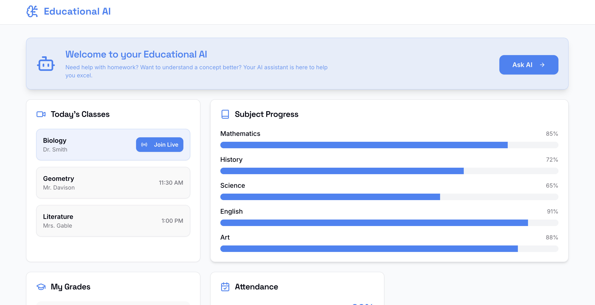
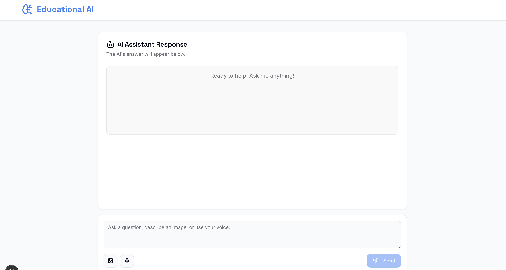
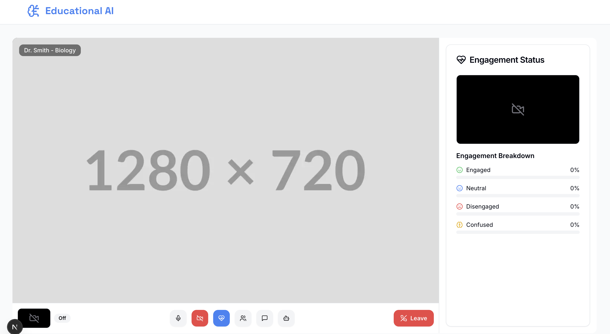

# Educational AI

A modern, multimodal AI-powered assistant designed for the classroom. This application provides students with an intelligent partner for a seamless and engaging learning experience, featuring real-time assistance, engagement monitoring, and a comprehensive academic dashboard.

# Home Page:


# AI Interface:


# Live Class Model:



## ✨ Key Features

-   **AI Companion Chat**: Ask questions using text, voice, or images and get comprehensive answers from a helpful AI assistant.
-   **Live Class View**: Join a virtual classroom with a live video feed and integrated tools.
-   **Student Dashboard**: A centralized view of your academic life, including:
    -   Today's classes with live join links.
    -   Subject-wise progress tracking.
    -   Upcoming assignments.
    -   Current grades and attendance records.
-   **Real-time Engagement Monitoring**: During live classes, the app uses your webcam to analyze engagement levels (Engaged, Neutral, Disengaged, Confused) and provides a private dashboard to help you stay focused.
-   **In-Class Tools**: Communicate with the teacher and classmates through a dedicated class chat panel.
-   **Secure Authentication**: A clean and simple login and signup flow to protect student data.

## 🛠️ Tech Stack

This project is built with a modern, performant, and scalable technology stack:

-   **Framework**: [Next.js](https://nextjs.org/) (with App Router)
-   **Language**: [TypeScript](https://www.typescriptlang.org/)
-   **AI/Generative**: [Firebase Genkit](https://firebase.google.com/docs/genkit) with [Google Gemini](https://ai.google.dev/)
-   **UI**: [React](https://react.dev/)
-   **Styling**: [Tailwind CSS](https://tailwindcss.com/)
-   **Component Library**: [ShadCN UI](https://ui.shadcn.com/)
-   **Icons**: [Lucide React](https://lucide.dev/)

## 🚀 Getting Started

Follow these instructions to get a local copy up and running for development and testing purposes.

### Prerequisites

-   [Node.js](https://nodejs.org/en) (version 18.x or later recommended)
-   [npm](https://www.npmjs.com/get-npm) or [yarn](https://yarnpkg.com/)

### Environment Variables

Before running the application, you need to set up your environment variables. Genkit uses these to authenticate with the Google AI services.

1.  Create a `.env` file in the root of the project.
2.  Add your Google AI API key to the `.env` file:

    ```sh
    GOOGLE_API_KEY=your_google_ai_api_key_here
    ```

### Installation & Running

1.  **Clone the repository:**
    ```sh
    git clone https://github.com/your-username/classroom-ai-companion.git
    cd classroom-ai-companion
    ```

2.  **Install dependencies:**
    ```sh
    npm install
    ```

3.  **Run the development server:**
    The application uses two concurrent processes: one for the Next.js app and one for the Genkit AI flows.

    -   In your first terminal, start the Next.js app:
        ```sh
        npm run dev
        ```
        This will start the web application, typically on `http://localhost:3000`.

    -   In a second terminal, start the Genkit development server:
        ```sh
        npm run genkit:dev
        ```
        This starts the Genkit flows and makes them available to the Next.js application.

4.  **Open the app:**
    Navigate to `http://localhost:3000` in your browser to see the application in action.

## 📝 License

This project is licensed under the MIT License - see the LICENSE.md file for details.
# Educational-AI
